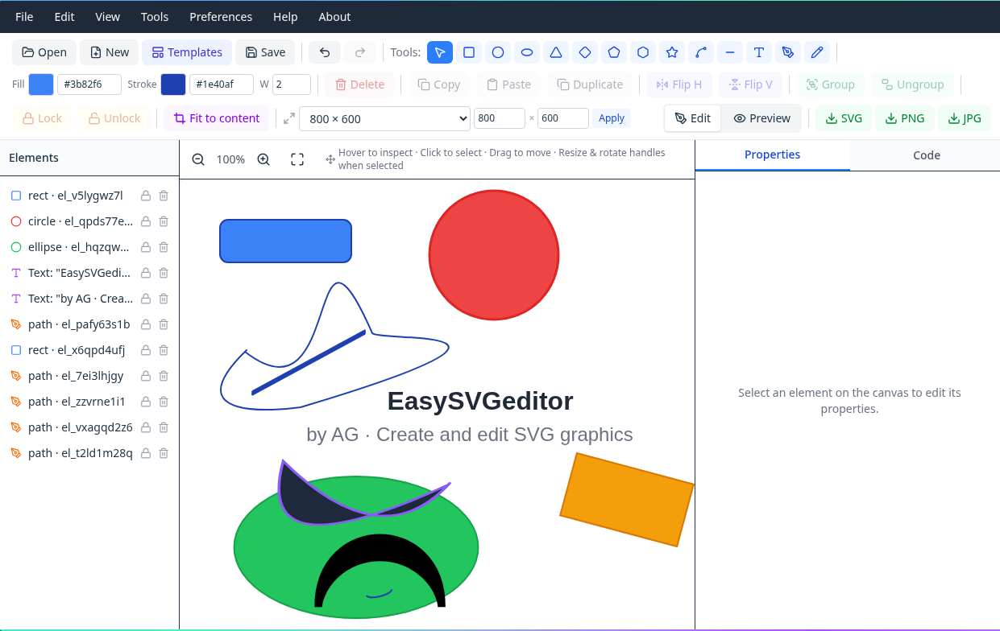

# EasySVGeditor

EasySVGeditor is a free, fully client-side vector graphics editor. Draw, style,
and export artwork — all in your browser, with nothing leaving your computer
unless you choose to save or export.

## Features

- **Drawing tools** — rectangle, circle, ellipse, triangle, diamond, pentagon,
  hexagon, star, arc, line, text, path and freehand pen.
- **Rich text** — per-letter fill & weight, plus word-level styling.
- **Path node editing** — drag individual anchor points of any path.
- **Layers / element tree** — select, lock, hide, reorder, group & ungroup.
- **Canvas presets** — HD, FHD, square, A4, icon sizes, or any custom size.
- **Export** — SVG, PNG, JPEG, and social-media size packs (ZIP).
- **Templates** — ready-made logo templates to start from.
- **Offline support** — installable PWA; works without internet after first load.
- **Undo / redo** with full history.

## Links

- **GitHub:** https://github.com/ZygoteTrend/EasySVGeditor
- **Support the project:** https://buymeacoffee.com/zygoteag

## License

EasySVGeditor is licensed under the [Apache License 2.0](LICENSE).

You may use, reproduce, and distribute the software subject to the terms in the
[`LICENSE`](LICENSE) file.

© 2026 AG.

